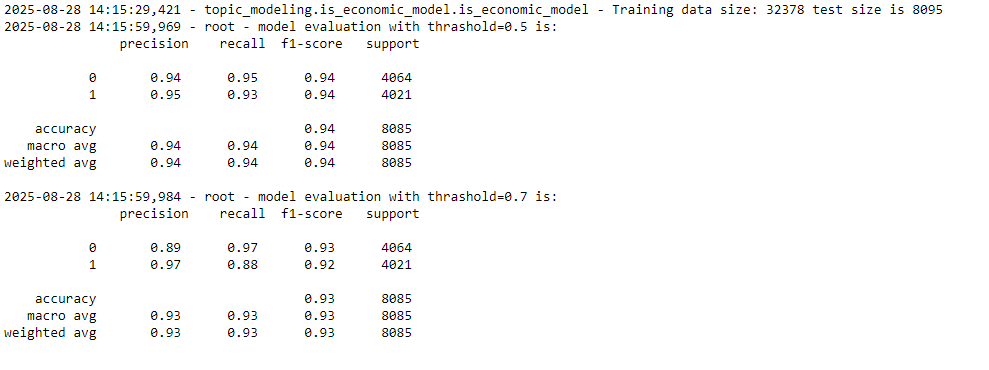

# TDM Sentiment Analysis Project

## Project Overview

This project implements a comprehensive pipeline for analyzing sentiment and topics in news articles from major US newspapers, with a focus on financial and economic content. It leverages TDM Studio (ProQuest) data and employs modern NLP techniques including BERT-based sentiment analysis and TF-IDF based topic modeling.

## Project Goals

1. Process and extract news articles from major US newspapers stored in xml files 
2. Classify articles as economic or non-economic using a a logistic regression model (under src/topic_modeling/is_economic_model) and select economic articles for the following steps 
3. Extract keywords from classified economic articles using tf idf method
4. Analyze sentiment score for classified economic articles
5. Create a structured dataset for further analysis

## Directory Structure
under directory structare file
### `/corpuses/`
Contains XML files from major news sources including:
- Chicago Tribune
- Los Angeles Times
- Newyork Times
- The Washington Post
- USA Today
- The Jerusalem Post

### `/data/`
- `/corpuses/`: for each corpus all xml files in a different folder 
- `/file_names/`: for each corpus txt files of xml file names selected for specific tasks
- `/processed/results/`: for each corpus Contains processed data in csv files with rich details (full articles) 
- `/processed/results_to_export/`: for each corpus Contains processed data without raw content that can be exported

### `/logs/`
Contains execution logs that track for a given task or step in pipleline the xml files olready run so if excecution crash we dont need to restart from begining.

### `/notebooks/`
- `/run/`: Main execution notebooks used to run functions, (preferred over pipline.py since TDM runs in Jupyter)
- `/experiments/`: Test notebooks for trying functions before running
- `/check_results/`: Notebooks for verifying processed results
- `/visualization/`: Notebooks for data visualization and reporting (including text_view to look at a specific article)

### `/src/`
Core source code:
- `config.py`: Configures global variables and folder paths
- `main.py`: Entry point for processing (limited use in TDM's Jupyter environment)
- `logger.py`: Tracks function execution to enable process resumption after failures
- `/data_utils/`: Data processing utilities
  - `tdm_parser.py`: Parser for TDM XML files
  - `xml_to_df.py`: Converts XML to DataFrame format
  - `properties_modifier.py`: Modifies CSV files with sentiment or topic data
- `/sentiment/`: Sentiment analysis components
  - `/sentiment_model/`: BERT sentiment models stored locally runs on GPU if available
  - `/salience_index/`: Weighted BERT sentiment model runs on GPU if available
- `topic_modeling/`: Core topic‑modeling modules  
  - `tf_idf_model/`: Extracts article tags using TF‑IDF runs on CPU
    ```txt
    tfidf(t, d, D) = tf(t, d) * log(|D| / |{d' in D : t in d'}|)

    where:
      t            = term
      d            = document
      D            = corpus (set of all documents)
      tf(t, d)     = term frequency of t in d
    ```  
  - `is_economic_model/`: Logistic‑regression classifier for economic articles 
    - **Labels:** predefined sections  
    - **Features:** TF‑IDF–vectorized text  
  the following is the model's performence for 0.5 and 0.7 thrasholds 
  


### Configuration
- `src/config.py`: Central configuration of paths and settings

### Data Processing
- `src/data_utils/tdm_parser.py`: Handles TDM Studio XML format
- `src/data_utils/file_process.py`: handles file structer Processes XML data into 

### Analysis Components
- `src/sentiment/sentiment_model/sentiment_score.py`: sentiment analyzer models
- `src/topic_modeling/tf_idf_model/tf_idf_model.py`: TF-IDF keyword extraction
- `src/topic_modeling/is_economic_model/is_economic_model.py`: Economic content classifier

### Main Entry Points
- `notebooks/run/run_pipeline.ipynb`: Runs pipline functions
- `notebooks/run/train_is_economic.ipynb`: Train and evaluate Economic content classifier model

## The `directory_map.txt` File

The `directory_map.txt` file in the src directory provides a comprehensive overview of the project structure and documents the purpose of each component. It serves as a navigation guide for understanding the organization of the codebase.

## TDM Studio Integration

This project is specifically designed to work with TDM Studio (ProQuest):
- Uses XML files from TDM Studio as input data
- Contains parsers specifically for TDM XML format
- Acknowledges TDM Studio's Jupyter environment constraints
- Optimized for TDM Studio's virtual machine setup
- fited for python version 10 

## Constraints and Limitations

1. **TDM Studio Environment**: The project is designed to run within TDM Studio's Jupyter environment, which may have limitations on package installations and system operations.
2. **Data Size**: The XML files can be large, requiring chunked processing.
3. **Proprietary Data**: The news articles are from proprietary sources and should be treated accordingly.
4. **Model Size**: The BERT models are large and may require significant resources.

## Running Instructions

### Minimal Requirements
- Python 3.7-10.9 
- Transformers
- Scikit-learn
- Pandas
- BeautifulSoup
- NLTK
- Torch
- joblib
- Pathlib
- concurrent.futures
- logging
- datetime
- numpy
- re


### Execution 
Run the notebooks under `notebooks/run/run.ipynb` to process the data and calculate
pipeline steps 

### Pipeline steps
`src/pipeline.py` exposes the main steps of the project. The default paths are read from `src/config.py` but can be overridden.

Available steps:

- `is_economic_step_holder` – give probability for articles beeing economic
- `roberta_step_holder` – add sentiment label to titles and all article text using roberta model (https://huggingface.co/j-hartmann/sentiment-roberta-large-english-3-classes)
- `bert_step_holder` – add sentiment label to titles and all article text using bert model (distilbert-base-uncased-finetuned-sst-2-english)
- `tfidf_step_holder` – append TF-IDF keywords to a corpus 
- `xmls_to_csv` – convert XML corpus files to CSV 

### export results 
craete results to export (without paragraph text) using `notebooks/run/results_to_results_export.ipynb` in order to export results  
